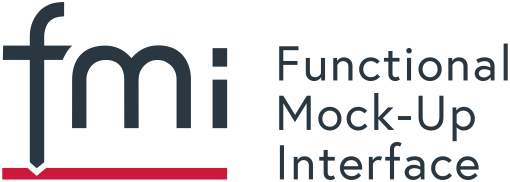

## FMIHydro

### About the project 

The **FMIHydro** project provides services related to the FMI technology. This includes:

 - Teaching about the FMI technology and its application in hydropower systems
 - Generation of FMUs of different parts of the hydropower system based on cyberphysical multi-domain models developed by us.
 - Specific consulting about digital solutions for hydropower systems.

### About FMI

The [Functional Mock-up Interface (FMI)](https://fmi-standard.org) is a free standard that defines a container and an interface to exchange dynamic models using a combination of XML files, binaries and C code zipped into a single file. It is supported by [170+ tools](http://fmi-standard.org/tools) and maintained as a [Modelica Association Project](https://modelica.org/projects) on GitHub. The code is released under the [2-Clause BSD](https://opensource.org/licenses/BSD-2-Clause), the docs under the [CC-BY-SA License](https://creativecommons.org/licenses/by-sa/4.0). 

### About FMU

*A Functional Mock-up Unit (FMU) is an abstract representation of a dynamic system based on a tool independent standard interface called [Functional Mock-up Interface (FMI)](https://fmi-standard.org). An FMU enables the exchange of models from a very diverse range of domains and applications.*

### Contact

You can reach us via email under: [contact@opensimhub.org](mailto:contact@opensimhub.org)
